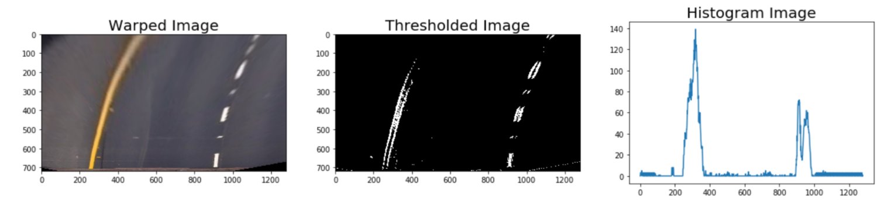

# Udacity Self-Driving Car Nanodegree: Advanced Lane Finding Project

## 1. Project Aims

This project aims to create an image processing pipeline that annotates images/videos captured by a car's front camera.The annotation informs:
 <ul>
  <li>The left and right lane of which the car moving between</li>
  <li>The lane curvature radius</li>
  <li>The car location relative to the lane's center</li>
</ul> 


## 2. Project Pipeline
The steps of this project are the following:

<ol>
  <li>Compute distortion matrix and coefficient by calibrating the camera with a set of chessboard images. After that, use the distortion matrix and coefficient to undistort the camera's test (road) images</li>
  <li>Determine the Region of Interest (ROI) that is relevant for lane lines extraction. Apply a perspective transform to have a bird eye view of the ROI</li>
  <li>Perform binary thresholding techniques (color and gradients) to extract lane lines from the images</li>
  <li>Detect lane pixels using histogram</li>
  <li>Fit a polynomial function to find the lane boundary</li>
  <li>Determine the curvature of the lane and vehicle position with respect to center</li>
  <li>Output annotated display of the lane boundaries and numerical estimation of lane curvature and vehicle position.</li>
</ol> 

[//]: # (Image References)

[image1]: ./examples/undistort_output.png "Undistorted"
[image2]: ./test_images/test1.jpg "Road Transformed"
[image3]: ./examples/binary_combo_example.jpg "Binary Example"
[image4]: ./examples/warped_straight_lines.jpg "Warp Example"
[image5]: ./examples/color_fit_lines.jpg "Fit Visual"
[image6]: ./examples/example_output.jpg "Output"
[video1]: ./project_video.mp4 "Video"


### 2.1 Distortion Correction

**Image distortion** occurs when a camera looks at 3D objects in the real world and transforms them into a 2D image. This transformation might be distorted due to the lenses curve (convex or concave). Distortion changes the **shape** and **size** of the 3D objects appear to be. 

The first step in analyzing camera images, is to undo this distortion. I undistort the camera by looking at chess images. The corners within the chess square is essential for this process.

I start by preparing **object points** and **image points** variable, taken from the chess images we use for distortion correction.

```python
objpoints = [] # 3D points in real world space
imgpoints = [] # 2D points in image plane
```

The **object points** refer to the (x, y, z) coordinates of the chessboard corners in the world. We assume that the chessboard is fixed on the (x, y) plane at z=0, and it is the camera that moves accordingly. This consideration helps us to find the X and Y values. 

We can simply set the (X,Y) points as (0,0), (1,0), (2,0) which denotes the location of points. We can also set that the object points are the same for each calibration image.
```python
# Prepare object points, like (0,0,0), (1,0,0), ..., (8, 5, 0)
objp = np.zeros((6*9,3), np.float32)
objp[:,:2] = np.mgrid[0:9, 0:6].T.reshape(-1,2) #reshape back to two columns
```

The **image points** are the (X,Y) coordinates of the chessboard corners in the image. The way we find our image points is by looking at the images and use `findChessboardCorners` function of OpenCV. You can look the code implementation of finding image points at section 1.4. of the advanced_lane_findings.ipynb notebook.

After that, we compare the object points with image points, and get our matrix and distortion coefficients.

```python
ret, mtx, dist, rvecs, tvecs = cv2.calibrateCamera(objpoints, imgpoints, img_size,None,None)
``` 

<p align="center">
  
  <em>Figure 1 - Distortion Correction of a Chess Image</em>
</p>

Finally, we use the camera matrix and distortion coefficients with the OpenCV function `undistort` to remove distortion from our test (road) images.

<p align="center">
  
  <em>Figure 2 - Distortion Correction of Our Road Image</em>
</p>

## 2.2 Region of Interest (ROI) and Perspective Transform

We select our **ROI** to make sure that our model focuses only on the lane within our image. The ROI is defined by our source points. 

```python
src = np.float32([[150,720],
                  [590,450],
                  [700,450],
                  [1250,720]])

dst= np.float32([[200,720], 
                 [200,0], 
                 [980,0], 
                 [980,720]])
```

After that, we define a matrix of destination points to perform perespective transform. The goal of our **perspective transform** is to convert the image to a "birds eye view" of the road. This transformation is done using OpenCV `getPerspectiveTransform` function. 

```python
# ROI function: Draw trapezium using the source coordinate
def ROI(originalImage):
    roi_image = cv2.polylines(originalImage, np.int32([src]), True,(0,0,255),10)
    return roi_image

# Warp function: Map source to destination points, to have a bird eyeview of the road image
def warp(image):
    y=image.shape[0]
    x=image.shape[1]

    # Compute perspective transform M
    M = cv2.getPerspectiveTransform(src,dst)
    
    # Create warped image - uses linear transformation
    warped = cv2.warpPerspective(image, M, (x,y), flags=cv2.INTER_LINEAR)
    
    return warped
```

Figure 3 shows our road image after the ROI is selected and perspective transform is performed.

<p align="center">
  
  <em>Figure 3 - ROI and Bird's Eye View Image</em>
</p>

## 2.3. Color and Gradient Thresholds

In this step, we perform binary thresholding technique to extract the lane lines in our images. We use a combination of **color** and **gradient**thresholds to generate a binary image.  

We use HLS color space as recommended in the Udacity course. Through our investigation, we find that the L and S channel of the HLS space is suitable for lane line extraction. The gradient thresholding is done by using sobel oeperator in X direction.

```python
# Combining color and sobel thresholding

def combine(warped_image):
    
    ## change image to HLS Space
    image = cv2.cvtColor(warped_image, cv2.COLOR_RGB2HLS)

    ## Color threshold
    l_color_threshold = [180, 255]
    s_color_threshold = [120, 255]
    l_channel = extract_channel(image, l_color_threshold,1)
    s_channel = extract_channel(image, s_color_threshold,2)
    
    ## Sobel x threshold
    sobel_threshold = [20, 100]
    sobelx = sobel_function(warped_image, sobel_threshold, 'x')
    
    combined_binary = np.zeros_like(s_channel)
    combined_binary[((s_channel == 1) & (l_channel==1)) | (sobelx == 1)  ] = 1
    return combined_binary
```

The selection of color space, gradient direction, and threshold values are done via trial and error. The output image of this binary thresholding is displayed by Figure 4 below. 

<p align="center">
  
  <em>Figure 4 - Thresholded Image</em>
</p>


## 2.4. Histogram for Lane Line Pixel Finding
We identify the lane line pixels by using **histogram** method. As the name susggest, we look into the histogram of pixel values of each section of the image. Then, we identify the peaks which represent the location of the lane lines pixel.

<p align="center">
  
  <em>Figure 5 - Histogram Image</em>
</p>

We divide the image into several window blocks as the location of the lane pixels are varying across the image. So each window contains a pixel coordinate (X,Y) that indicate the position of the lane lines within the window. 

The window's pixel coordinates is then used to perform **polynomial fit**. This process converts lane coordinates across window to form a polynomial equation of the lane line.

```python
def fit_polynomial(binary_warped):
    # Find our lane pixels first
    leftx, lefty, rightx, righty, out_img = find_lane_windows(binary_warped)

    # Fit a second order polynomial to each using `np.polyfit`
    left_fit = np.polyfit(lefty, leftx, 2)
    right_fit = np.polyfit(righty, rightx, 2)

    # Generate x and y values for plotting
    ploty = np.linspace(0, binary_warped.shape[0]-1, binary_warped.shape[0] )
    try:
        left_fitx = left_fit[0]*ploty**2 + left_fit[1]*ploty + left_fit[2]
        right_fitx = right_fit[0]*ploty**2 + right_fit[1]*ploty + right_fit[2]
    except TypeError:
        # Avoids an error if `left` and `right_fit` are still none or incorrect
        print('The function failed to fit a line!')
        left_fitx = 1*ploty**2 + 1*ploty
        right_fitx = 1*ploty**2 + 1*ploty

    ## Visualization ##
    # Colors in the left and right lane regions
    out_img[lefty, leftx] = [255, 0, 0]
    out_img[righty, rightx] = [0, 0, 255]

    # Plots the left and right polynomials on the lane lines
    plt.plot(left_fitx, ploty, color='yellow')
    plt.plot(right_fitx, ploty, color='yellow')

    return out_img, left_fit, right_fit, left_fitx, right_fitx, ploty
```

Figure XYZ display the yellow line which indicates that.

<p align="center">
  
  <em>Figure 6 - Windowed Lane Lines with Yellow Reconstructed Polynomial Line</em>
</p>

After that we smoothed the windows by using the code from point 4.2 in the advance_lane_findings.ipynb notebook. Figure 7 displays the output of this smoothing process.

<p align="center">
  
  <em>Figure 7 - Smoothed Window with Yellow Reconstructed Polynomial Line</em>
</p>

## 2.5. Unwarp Images

Next, we unwarp the images by inversing the perspective transform and the polynomial lane line. The code for this is available in section 5.2. in the advanced_lane_finding.ipynb notebook. 

Figure displays the results of the unwarping process.

<p align="center">
  
  <em>Figure 8 - Unwarped Image</em>
</p>


## 2.6. Lane Line Curvature Radius and Vehicle Distance

We calculate the radius of the lane line as well as the deviation of the vehicle from the center of the lane in this process. The code is included in section 6 (`calculate_lane_radius` function) of the notebook.

The lane line curvature is measured by implementing some mathematical formula in our code. The formula is as follow: 

`x = mx / (my**2) * a * (y**2) + (mx / my) * b * y + c`

This radius changes as the vehicle move along as in our video. The implementation of this formula is contained in section a.b. of advanced_lane_finding.ipynb notebook file. 


## 3. Building the Pipeline

After building each component of the lane finder. We combine each of the components into a function called `pipeline`. The function works as follow:

```python
def pipeline(image):
    original_image= cv2.cvtColor(image, cv2.COLOR_BGR2RGB)
    undistorted_image = cal_undistort(original_image) # undistorting image 
    warped_image = warp(undistorted_image)
    combined_image= combine(warped_image)
    result, left_lane, right_lane = search_around_poly(combined_image, draw=False)
    #VisualizeSlidingWindow(combinedImage, left_fit,right_fit, returnedOutput[2], returnedOutput[3],returnedOutput[4])
    final_image= draw_line(original_image,combined_image,left_lane,right_lane)
    #cv2.imwrite('./test/'+str(randint(0, 99999))+'.jpg',originalImage)
    
    radius, distance = calculate_lane_radius(combined_image,left_lane,right_lane)
    cv2.putText(final_image,"Radius of Curvature is " + str(int(radius))+ "m", (100,100), 2, 1, (255,255,0),2)
    #print(distance)
    cv2.putText(final_image,"Distance from center is {:2f}".format(distance)+ "m", (100,150), 2, 1, (255,255,0),2)
    ts = time.time()
    st = datetime.datetime.fromtimestamp(ts).strftime('%Y%m%d %H%M%S')
        
    cv2.imwrite('./Output_1/'+str(st)+'.jpg',original_image)
    
    cv2.imwrite('./Output_1/'+str(st)+'_o.jpg',final_image)
    new_combined_image= np.dstack((combined_image*255,combined_image*255,combined_image*255))
    final_image[100:240,1000:1200, :]= cv2.resize(new_combined_image, (200,140))
    return cv2.cvtColor(final_image, cv2.COLOR_BGR2RGB)
```

### 3.1. Results on Images

Figure XYZ display how our pipeline pipeline provides us (1) the left and right lane position, (2) the radius of the lane curvatture, and (3) the distance of the car relative to the lane's center.

<p align="center">
  
  <em>Figure 9 - Pipeline Image Output</em>
</p>


### 3.2. Results on Videos

Here is the [link to my video result](./project_video.mp4). As you can see in the GIF below the pipeline provides us the information similar to what we have seen in figure XYZ  but in a video.

## 4. Discussion
As we can see by the [project video](videos/project_video_augmented.mp4) the pipeline works well for a "simple" video stream,  This is becase there's litte changes in elevation, lighting or any steep bends.

---

If we analyse the slightly harder video:


We can clearly see that the pipeline start to struggle, this is because this video adds features like a concrete seperator that projects a shadow into the lane and paralel to the lane lines. Close to the camera the model works relatively well but near the escape point we can see the lane detection starting to fail.

---

If we then look at the more challenging video:


It's obvious that the model does not perform well. The lane boundary is "all over the place" and could not keep the car inside the lane.
This is most likely due to the nature of the road, single line for each traffic direction, steeper bends and a higher proximity to the side of the road.

## 5. Link

The project report, code, images, and videos can be found here:
